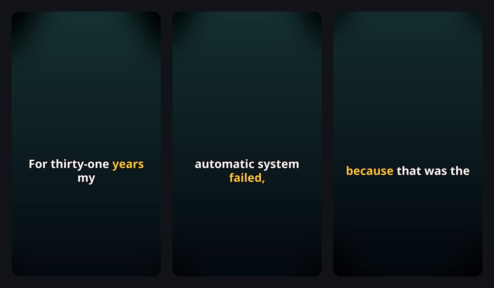
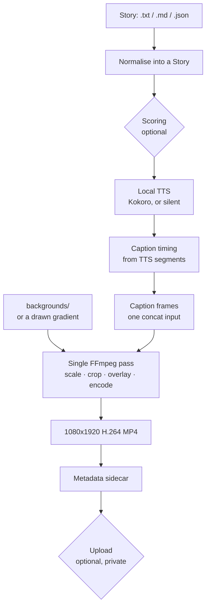

<div align="center">

# Resumex

**Turn stories into short-form videos — locally.**

Local TTS · word-level captions · 9:16 rendering · optional AI · optional publishing

[](https://github.com/Olwtelet/Resumex/actions/workflows/ci.yml)
[](https://www.python.org/downloads/)
[](LICENSE)



<sub>Real frames from `resumex demo` — no setup, no downloads, no accounts.</sub>

</div>

---

## Why Resumex

Making a narrated vertical video from a piece of text is a solved problem that
is still annoying to do: synthesise speech, work out when each word is spoken,
draw captions, find a backdrop, encode to the right shape, keep track of what
you already made.

Resumex is that pipeline as one command. It runs on your machine, it does not
require an account anywhere, and the only thing you have to install yourself is
FFmpeg.

It is **not** an audience-growth tool. There is no telemetry, no scraping of
other people's videos, no auto-publishing, and no claim that a piece of writing
will do well.

## Features

- **Runs offline.** Rendering needs FFmpeg and nothing else. No API key, no
  network call, no sign-in.
- **Your own text, first class.** Point it at a `.txt`, `.md` or `.json` file.
- **Local speech.** [Kokoro](https://github.com/hexgrad/kokoro) runs on your
  CPU when you install the `tts` extra. Weights are cached by Kokoro itself.
- **Captions without transcription.** Timing comes from the speech synthesiser's
  own segments, so nothing has to listen back to the audio it just produced.
- **Deterministic rendering.** One FFmpeg invocation, one argument list, no
  shell. 1080×1920, H.264, AAC, faststart MP4.
- **Bring your own backdrop.** Drop footage or stills in `backgrounds/`, or let
  Resumex draw a gradient.
- **Optional AI.** A local Ollama model can write titles or rate stories. Turn
  it off and a deterministic implementation takes over.
- **Optional publishing.** YouTube uploads are opt-in, **private by default**,
  and never delete your local file.
- **Knows what it made.** A SQLite state file records stories, renders and
  uploads, so batches skip work they already did.

## 30-second demo

```bash
resumex demo
```

Writes a real `1080x1920` MP4 to `demo_output/resumex-demo.mp4` in about ten
seconds. It uses a bundled sample story, a locally drawn background and a silent
audio track, so it needs no model download, no credentials and no network.

```
Resumex demo
     story:      demo.md (bundled)
     narration:  silent (no model download)
     background: generated locally

  -> Narrating
  -> Timing captions (21.8s of narration)
  -> Preparing background
  -> Composing 1080x1920 video
  -> Writing metadata

[ok] demo_output/resumex-demo.mp4
     1080x1920 | 21.8s | audio | narrated by silent
```

Add real speech with `resumex demo --tts` once the `tts` extra is installed.

## Quick start

**Requirements:** Python 3.11+ and [FFmpeg](https://ffmpeg.org/download.html)
(`ffmpeg` and `ffprobe` on your `PATH`).

```bash
git clone https://github.com/Olwtelet/Resumex.git
cd Resumex
python -m venv .venv
```

Activate it — `source .venv/bin/activate` on macOS and Linux,
`.venv\Scripts\activate` on Windows — then:

```bash
pip install -e .
resumex doctor
resumex demo
```

`resumex doctor` tells you exactly what is available and what is merely
optional:

```
Resumex doctor
[ok] Python 3.12.4
[ok] FFmpeg               7.1
[ok] ffprobe              available
[ok] Workspace            /home/you/videos
[ok] Write access         workspace is writable
[ok] Caption font         NotoSans-Bold.ttf

Optional
[--] Speech (Kokoro)      not installed - pip install "resumex[tts]"
[ok] Silent narration     available, so rendering still works
[--] Ollama               disabled (optional)
[--] Reddit source        disabled (optional)
[--] YouTube upload       disabled (optional)

[ok] Ready to render.  Try:  resumex demo
```

### Making a video from your own story

```bash
resumex init                       # creates backgrounds/, stories/, output/ and resumex.toml
```

Write `stories/my-story.md`:

```markdown
# The title of my story

The body. Any number of paragraphs.
```

Then:

```bash
pip install "resumex[tts]"         # real speech, ~1 GB of model on first run
resumex render stories/my-story.md
```

## Example commands

| Command | What it does |
| --- | --- |
| `resumex --help` | every command and flag |
| `resumex init` | create the workspace and a commented config file |
| `resumex doctor` | check FFmpeg, paths and optional integrations |
| `resumex demo` | render a sample video with nothing installed |
| `resumex render story.md` | render one story |
| `resumex render notes.json --all` | render every story in a JSON file |
| `resumex render story.md -b clip.mp4` | use a specific background |
| `resumex batch ./stories --limit 5` | render a directory, skipping what is done |
| `resumex stats` | what this workspace has produced |
| `resumex youtube-auth` | authorise uploads in a browser |
| `resumex upload output/story.mp4` | publish, private unless told otherwise |

Anything can also be run as `python -m resumex ...`.

### Story formats

`.md` uses the first heading as the title. `.txt` uses the first non-empty
line. `.json` takes an object, or an array of them:

```json
{
  "title": "My story",
  "body": "Story content...",
  "author": "optional",
  "source_url": "optional"
}
```

Only `title` and `body` are required.

## How it works



The step that usually costs the most is the one that is missing. Most pipelines
synthesise speech and then transcribe it with Whisper to find out when each word
was spoken. Kokoro already returns one audio segment per chunk of text it
speaks, so Resumex reads the timing off those segments and distributes it across
words by length. No second model, no second pass over the audio.

## Configuration

`resumex init` writes a `resumex.toml` with every option commented. The full
reference is [`resumex.example.toml`](resumex.example.toml). Everything has a
default; delete what you do not need.

```toml
[render]
width = 1080
height = 1920
fps = 30
caption_max_words = 4
caption_position = 0.62      # 0.0 top of frame, 1.0 bottom
background_dim = 0.35

[narration]
provider = "auto"            # "auto" | "kokoro" | "silent"
voice = "af_heart"
```

An unknown key is an error, not a silent no-op — a typo tells you so and lists
the keys that section accepts.

A few environment variables win over the file, for CI and containers:
`RESUMEX_WORKSPACE`, `RESUMEX_CONFIG`, `RESUMEX_FFMPEG`, `RESUMEX_FFPROBE`,
`RESUMEX_VOICE`, `RESUMEX_NARRATION_PROVIDER`, `RESUMEX_OLLAMA_URL`,
`RESUMEX_OLLAMA_MODEL`.

### Workspace layout

```
your-workspace/
├── resumex.toml
├── backgrounds/        your footage and stills
├── stories/            your .txt / .md / .json files
├── output/             rendered MP4s and their .metadata.json sidecars
└── .resumex/           state database and scratch space
```

## Optional integrations

Every one of these is off until you turn it on, and none of them can stop a
render.

| Extra | Install | Gives you |
| --- | --- | --- |
| Speech | `pip install "resumex[tts]"` | Kokoro narration instead of silence |
| Publishing | `pip install "resumex[youtube]"` | `resumex upload` |
| Everything | `pip install "resumex[all]"` | both |

**Ollama.** Set `ollama.enabled = true` and point `metadata.provider` or
`scoring.provider` at `"ollama"` to have a local model write titles or rate how
well a story reads aloud. If the daemon is not answering, Resumex logs it and
uses the deterministic implementation instead. See [ollama.com](https://ollama.com).

**YouTube.** Create an OAuth client (Desktop app) with the YouTube Data API v3
enabled in the [Google Cloud console](https://console.cloud.google.com/), point
`youtube.client_secrets` at the downloaded JSON, then run `resumex youtube-auth`.
Uploads default to `private`; publishing openly takes an explicit
`--privacy public`. See the
[YouTube upload guide](https://developers.google.com/youtube/v3/guides/uploading_a_video).

**Reddit.** `reddit.enabled = true` plus a list of subreddits lets
`resumex batch --source reddit` pull public self-post text over Reddit's JSON
listings. There is no browser automation and no attempt to evade anything; if
Reddit declines, you get a clear message and everything else keeps working.

## Project architecture

```
src/resumex/
├── cli.py            argparse front end, one handler per command
├── config.py         every setting and every path, in one place
├── models.py         Story, StoryScore, NarrationResult, CaptionCue, ...
├── pipeline.py       stage order and scratch-file lifetime
├── doctor.py         environment report
├── exceptions.py     errors carrying a hint and an exit code
├── sources/          local files, Reddit
├── scoring/          heuristic, Ollama
├── narration/        Kokoro, silent
├── captions/         timing, frame rendering
├── rendering/        FFmpeg wrapper, backgrounds, compositor
├── metadata/         deterministic, Ollama
├── upload/           YouTube
└── state/            SQLite store
```

Two rules hold the shape: domain logic never performs IO directly, and every
optional provider sits behind an interface with a working local implementation
on the other side.

## Development

```bash
pip install -e ".[dev]"
ruff check .
pytest
```

The default `pytest` run is offline by construction — a fixture replaces
`socket.connect`, so an accidental network call fails the test. The one test
that shells out to FFmpeg is marked `integration` and skips itself when FFmpeg
is not installed:

```bash
pytest -m "not integration"    # pure unit tests
pytest -m integration          # renders and probes a real MP4
```

`resumex.example.toml` is generated from `config.EXAMPLE_CONFIG`; a test fails
if the two drift apart.

## Troubleshooting

**`FFmpeg was not found on PATH`** — install it and run `resumex doctor` again.
`brew install ffmpeg`, `sudo apt install ffmpeg`, or
`winget install Gyan.FFmpeg`. If it lives somewhere unusual, set
`RESUMEX_FFMPEG` and `RESUMEX_FFPROBE`, or the `[tools]` section of the config.

**The demo video is silent.** That is deliberate — the demo proves the renderer
works without downloading a speech model. Install the `tts` extra and use
`resumex demo --tts`.

**The first `--tts` run takes minutes.** Kokoro is downloading its weights. That
happens once, into the usual Hugging Face cache, not into this repository.

**Captions are cut off or too large.** Lower `render.font_size` or
`render.caption_max_words`. Long single words get their own line rather than
being scaled down.

**A batch says there is nothing to do.** Those stories have already been
rendered. Pass `--redo` to render them again.

**Something failed and I want the traceback.** Add `-v`.

## Contributing

Issues and pull requests are welcome. [CONTRIBUTING.md](CONTRIBUTING.md) covers
the setup, the conventions and what a good change looks like. Please read the
[Code of Conduct](CODE_OF_CONDUCT.md) and report security problems as described
in [SECURITY.md](SECURITY.md).

## License

MIT — see [LICENSE](LICENSE).

The bundled Noto Sans Bold typeface is licensed separately under the SIL Open
Font License 1.1; FFmpeg, Kokoro and the Google API client libraries keep their
own terms. All of it is recorded in
[THIRD_PARTY_NOTICES.md](THIRD_PARTY_NOTICES.md).
